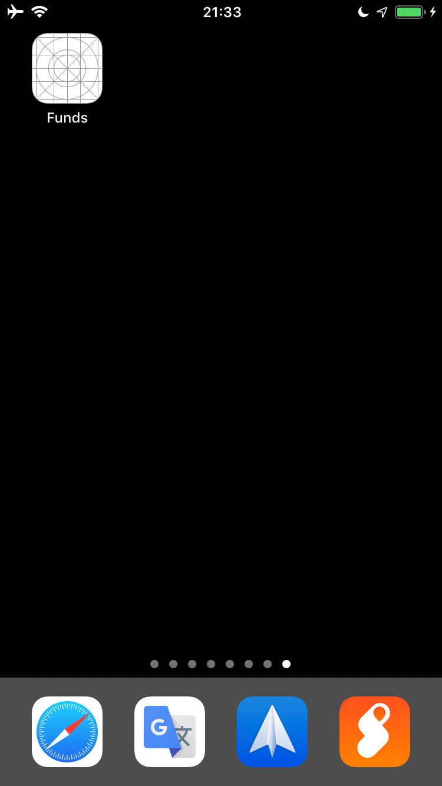
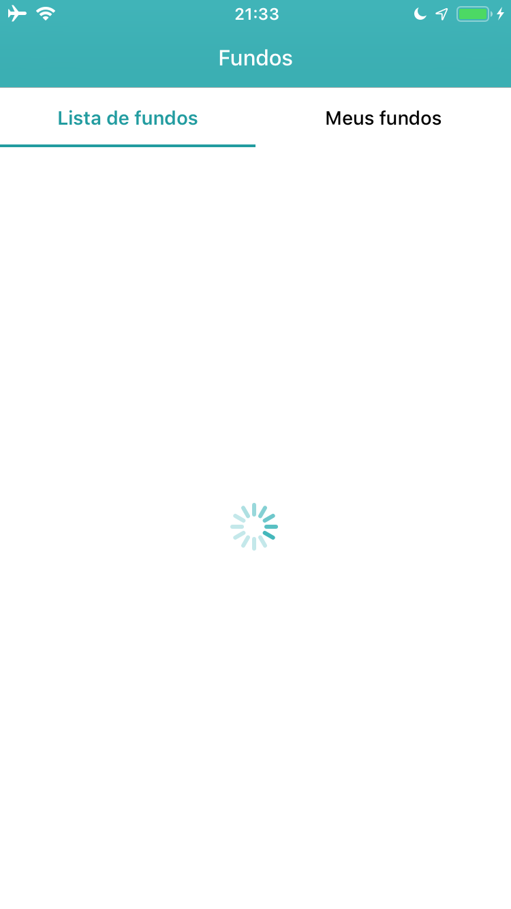
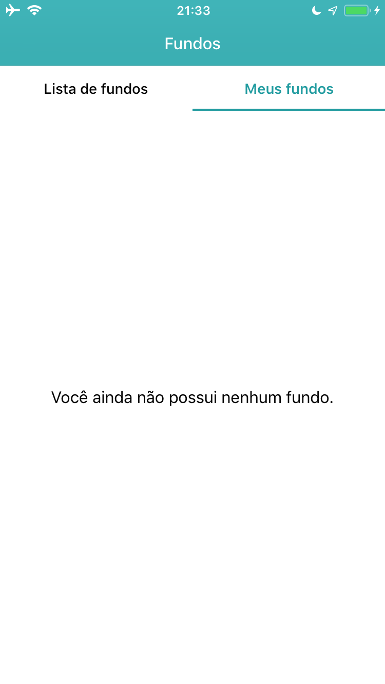
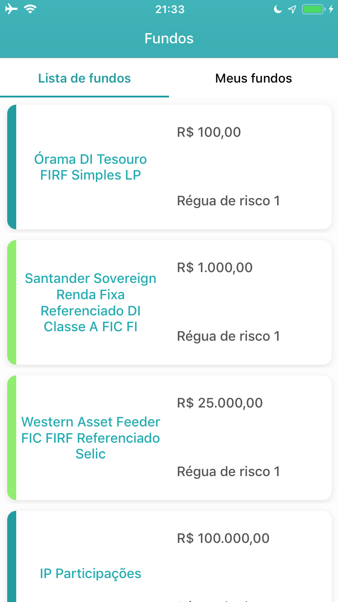
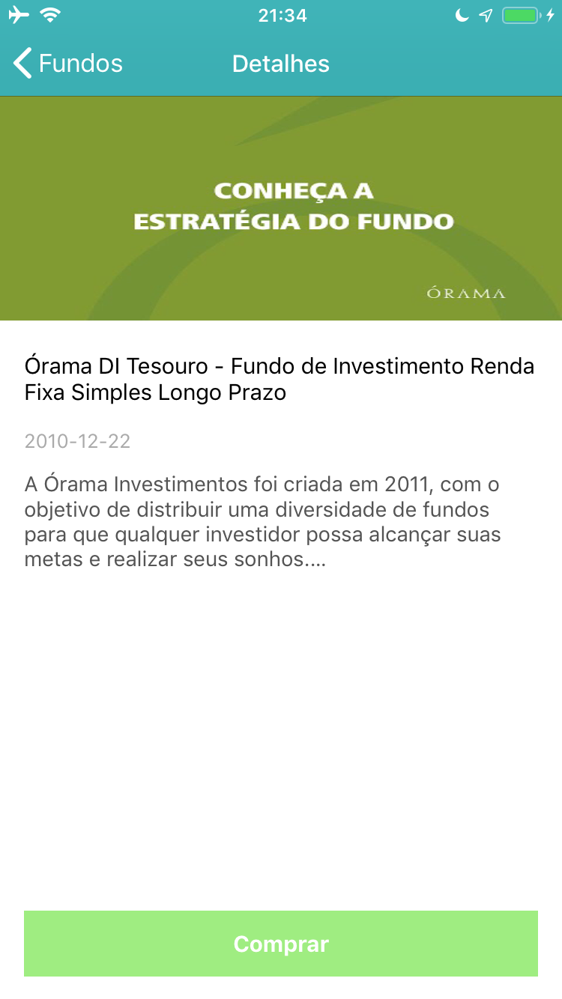
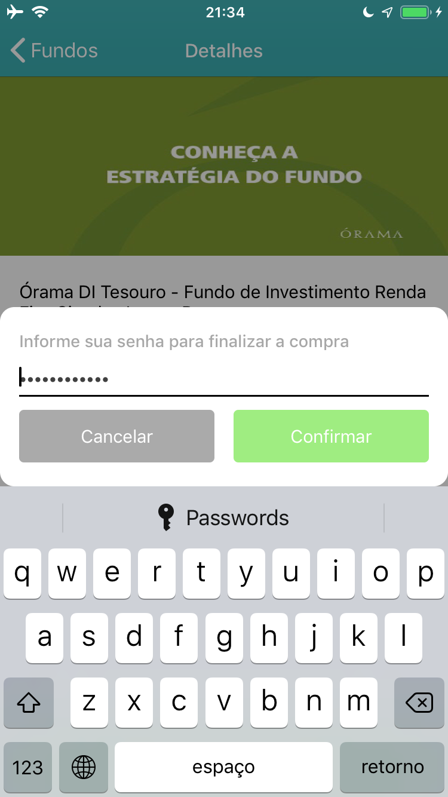
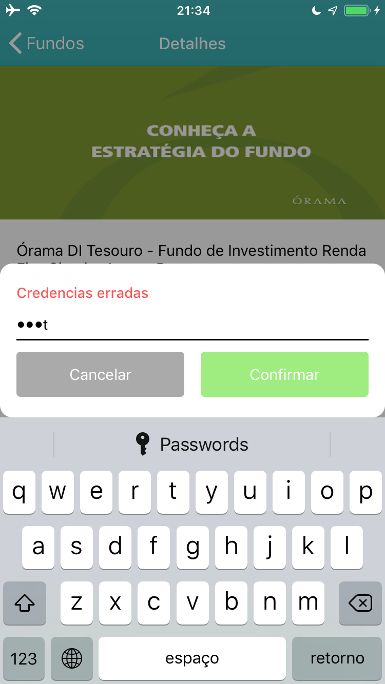

# Instructions

- Download Xcode from the Mac App Store.
- In Xcode, add your Apple ID to Accounts preferences.
- Open FundInvestmentDemo.xcworkspace (NOT FundInvestmentDemo.xcodeproj).
- Tap on FundInvestmentDemo in the Targets list.
- Change the Bundle Identifier to com.yourname.FundInvestmentDemo
- Tap General and choose your name from the Team pop-up menu.
- Connect the device to your Mac and choose your device from the Scheme toolbar menu.
- Below the Team pop-up menu, click Fix Issue.
- Click the Run button.

# Screenshots

# Youtube Video URL

https://youtu.be/_8RBsyyPo-Q
